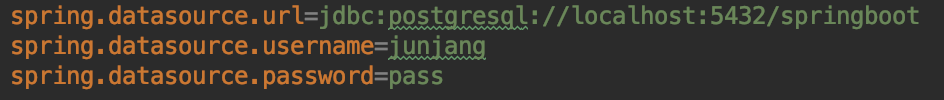
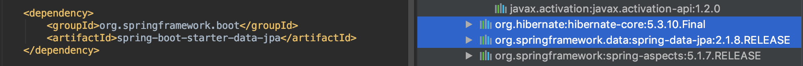
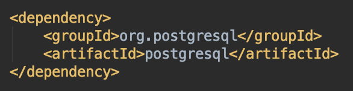
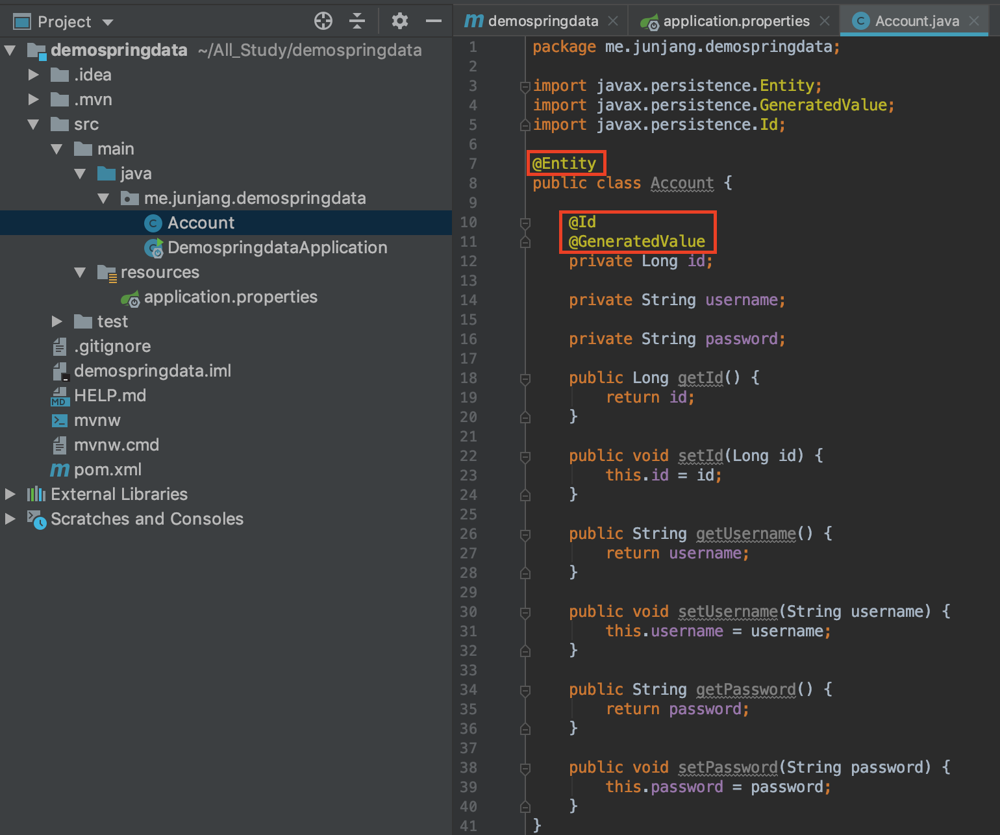
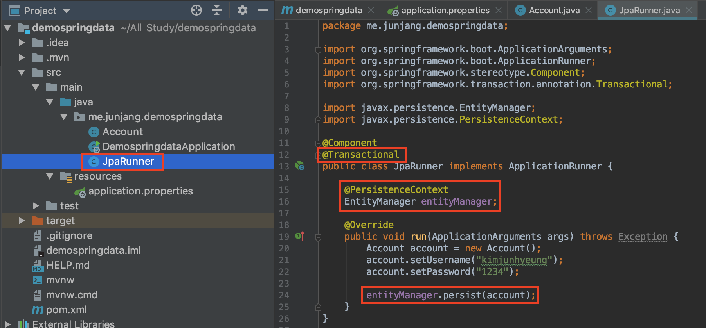
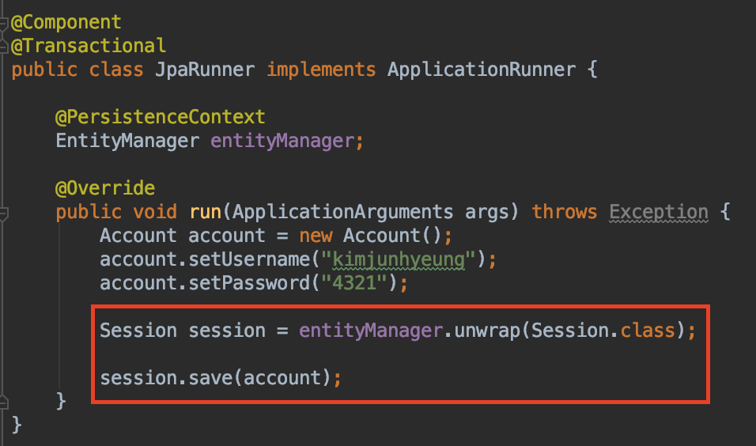

<br/>

# 프로젝트 세팅

JPA를 활용하는 프로젝트를 만드는 방법을 알아봅시다.

- 개발 환경
- IntelliJ Ultimate 2019.01.02
- Mac OS Mojave
- Docker 2.0.0.3
- PostgreSQL
- SpringBoot 2.1.5
- Hibernate 5.3.10<br/>
  <br/>

## 데이터베이스 실행

Docker를 활용하여 postgreSQL을 연동합니다. 혹시 Docker를 활용하지 않으셨다면 [postgreSQL](https://junjangsee.github.io/2019/05/13/spring/spring-25/)를 참고해주시면 됩니다.<br/>
<br/>

## JDBC 설정

```
spring.datasource.url=jdbc:postgresql://localhost:5432/springboot
spring.datasource.username=junjang
spring.datasource.password=pass
```

 Docker에서 설치 및 실행시 설정했던 값으로 연동합니다.<br/>
<br/>

## 데이터관련 의존성 추가

```xml
        <dependency>
            <groupId>org.springframework.boot</groupId>
            <artifactId>spring-boot-starter-data-jpa</artifactId>
        </dependency>

        <dependency>
            <groupId>org.postgresql</groupId>
            <artifactId>postgresql</artifactId>
        </dependency>
```

 JPA 의존성을 추가하면 하이버네이트와 같이 의존성이 추가됩니다.<br/>
 PostgreSQL을 사용하기 위해 드라이버 의존성을 추가합니다.
만약 추가하지 않으면 **Driver** 에러가 발생합니다.<br/>
<br/>

## 도메인 클래스 생성

JPA는 도메인객체를 활용하여 객체와 릴레이션간 연동을 합니다. 생성하고 매핑하는 법에 대해 알아보겠습니다.<br/>

```java
@Entity
public class Account {

    @Id
    @GeneratedValue
    private Long id;

    private String username;

    private String password;

    public Long getId() {
        return id;
    }

    public void setId(Long id) {
        this.id = id;
    }

    public String getUsername() {
        return username;
    }

    public void setUsername(String username) {
        this.username = username;
    }

    public String getPassword() {
        return password;
    }

    public void setPassword(String password) {
        this.password = password;
    }
}
```

- @Entity : 이 클래스를 JPA와 연동하기 위해 빈으로 등록합니다.
- @Id : Entity의 기본 키를 나타내며 하나 이상 필요합니다.
- @GeneratedValue : 자동으로 생성되도록 합니다. 만약 선언하지 않으면 수동작업을 해주어야 합니다.

 위 세가지의 어노테이션이 JPA의 핵심 기능이라고 보면 되겠습니다.<br/><br/>

## spring.jpa.hibernate.ddl-auto

위 설정은 이전 데이터베이스 초기화 부분에서 학습했었습니다. 현재 필요한 개념이기 때문에 다시 한 번 복습하겠습니다.<br/>

```
spring.jpa.hibernate.ddl-auto=
```

위 옵션을 통해서 스키마를 운영할 수 있습니다.

- update: 기존의 스키마는 놔두고 추가된 사항만 변경합니다.
- create-drop: 처음에 스키마를 만들고 Application 종료시 스키마를 drop합니다.
- create: 처음에 스키마를 삭제하고 스키마를 새로 만듭니다.
- validate: 현재 Entity 매핑이 릴레이션 DB에 맵핑할 수 있는 상황인지 맵핑이 되는지를 검증합니다.(운영환경에서 사용)
- 테스트 환경에선 필요하지 않은 옵션입니다.(주석처리)

<br/>

## JpaRunner 클래스

애플리케이션이 실행시 데이터를 영속화 할 수 있도록 하기위해 만든 클래스입니다. JPA, Hibernate의 함수 두가지 종류를 이용해서 데이터를 저장시켜 보겠습니다.<br/>

### JPA 함수를 활용

```java
@Component
@Transactional
public class JpaRunner implements ApplicationRunner {

    @PersistenceContext
    EntityManager entityManager;

    @Override
    public void run(ApplicationArguments args) throws Exception {
        Account account = new Account();
        account.setUsername("kimjunhyeung");
        account.setPassword("1234");

        entityManager.persist(account);
    }
}
```

 데이터를 영속적으로 저장하기 위해서는 **@Transactional** 어노테이션을 필수로 합니다. 그리고 **@PersistenceContext**를 통해서 JPA의 핵심인 **EntityManager**를 주입 받아 이 객체를 사용하여 데이터를 추가합니다.
account에 데이터를 set하고 entityManager의 persist()를 통해 데이터를 넣고 테이블 컬럼을 조회하면 데이터가 들어간 모습을 볼 수 있습니다.<br/>
<br/>

### hibernate 함수를 활용

```java
@Component
@Transactional
public class JpaRunner implements ApplicationRunner {

    @PersistenceContext
    EntityManager entityManager;

    @Override
    public void run(ApplicationArguments args) throws Exception {
        Account account = new Account();
        account.setUsername("kimjunhyeung");
        account.setPassword("4321");

        Session session = entityManager.unwrap(Session.class);

        session.save(account);
    }
}
```

 session을 활용하여 save()로 데이터를 저장할 수 있습니다.<br/><br/>

## createClob() 에러가 뜬다면?

이 에러는 postgresql 드라이버가 **createClob()** 메서드를 구현하지 않아 경고문구가 출력되는 것입니다.<br/>

```
spring.jpa.properties.hibernate.jdbc.lob.non_contextual_creation=true
```

application.properties에 위 설정을 추가하시면 이상없이 결과가 출력될 것입니다.<br/>
