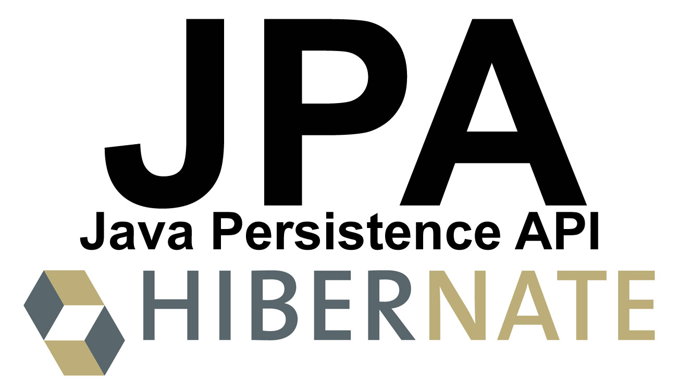

<br/>

# 엔티티 상태

엔티티 상태에 따라서 데이터베이스에 반영되는 상태가 달라집니다. 상태의 종류와 그 상태를 전파하는 Cascade를 학습해보겠습니다.<br/>
<br/>

## 엔티티 상태의 종류

### Transient

JPA가 **모르는** 상태입니다. 즉 관리하고 있는 대상이 아닙니다.

- new Object() 처럼 객체만 생성했을 때를 나타냅니다.

<br/>

### Persistent

JPA가 **관리중**인 상태입니다. Persistent 상태에서 관리하고 있던 객체가 데이터베이스에 넣는 시점에 데이터를 저장합니다.

- Transient상태에서 Session.save()를 통해 Persistent 상태로 넘어옵니다.
- Session.get(), Session.load(), Query.iterate() 등의 함수를 사용합니다.

<br/>
#### 1차 캐시
**Persistent Context**(EntityManager, Session)에 인스턴스가 있는 것을 말합니다. 아직 저장이 되지 않은 상태에서 다시 인스턴스를 달라고 하면 이미 객체가 있으므로 데이터베이스에 가지 않고 **캐시**하고 있는 것을 주게 됩니다.<br/>
즉 아직 저장이 안된 객체를 다시 가져다가 쓴다는 것과 비슷합니다.<br/>
```java
@Component
@Transactional
public class JpaRunner implements ApplicationRunner {

    @PersistenceContext
    EntityManager entityManager;

    @Override
    public void run(ApplicationArguments args) throws Exception {
        /** Transient 상태 **/
        Account account = new Account();
        account.setUsername("junjang");
        account.setPassword("1234");

        Study study = new Study();
        study.setName("Spring Data JPA");

        account.addStudy(study);

        /** Persistent 상태 **/
        session.save(account);
        session.save(study);

        /** 데이터베이스에 가지 않고 이미 1차 캐쉬에 저장된 인스턴스를 가져옴 **/
        Account junjang = session.load(Account.class, account.getId());
        junjang.setUsername("kimjunhyeung");
        System.out.println("=====================");
        System.out.println(junjang.getUsername());
        System.out.println("=====================");
    }

}

````
account 객체에 "junjang"이라고 캐싱이 되어있지만 "kimjunhyeung"으로 다시 수정합니다.
 최종적으로 **insert되기 전** 바뀌고 최종적으로 **update**된 것을 확인할 수 있습니다.<br/>
<br/>

#### Dirty Checking, Write Behind
- Dirty Checking : 객체의 변경사항을 계속 감지합니다.
- Write Behind : 객체의 상태의 변화를 데이터베이스에 최대한 늦게 가장 필요한 시점에 적용을 합니다.

```java
@Component
@Transactional
public class JpaRunner implements ApplicationRunner {

    @PersistenceContext
    EntityManager entityManager;

    @Override
    public void run(ApplicationArguments args) throws Exception {
        /** Transient 상태 **/
        Account account = new Account();
        account.setUsername("junjang");
        account.setPassword("1234");

        Study study = new Study();
        study.setName("Spring Data JPA");

        account.addStudy(study);

        /** Persistent 상태 **/
        session.save(account);
        session.save(study);

        /** 데이터베이스에 가지 않고 이미 1차 캐쉬에 저장된 인스턴스를 가져옴 **/
        Account junjang = session.load(Account.class, account.getId());
        junjang.setUsername("kimjunhyeung");
        junjang.setUsername("junhyeung");
        junjang.setUsername("junjang");
        System.out.println("=====================");
        System.out.println(junjang.getUsername());
    }
}
````

캐싱 중 객체 값을 많이 바꾸고 최종은 최초 객체 값고 동일하게 선언합니다.
 junjang이 출력되고 바뀐 객체애 대한 update가 없습니다.
이처럼 객체의 변경사항을 계속 주시하고 주시한 객체에 대해 마지막에 반영 함으로써 성능의 효율성을 도모합니다.<br/>
<br/>

### Detached

JPA가 더이상 관리하지 않는 상태로서 Transaction 이 끝났을 때 이미 데이터베이스에 저장이되고 Session이 끝난 상태입니다.

- Session.evict(), Session.clear(), Session.close() 등의 함수를 사용합니다.

<br/>

### Removed

JPA가 관리하긴 하지만 삭제하기로 한 상태입니다.

- Session.delete() 함수를 활용하여 삭제합니다.

<br/>

## Cascade

위에서 설명한 엔티티의 상태들을 전파하는 옵션입니다. 각 상태마다 특정 설정을 통해 상태를 통제할 수 있습니다.<br/>
하나의 글에 대한 여러개의 코멘트가 달리는 상황인 Parent 와 Child 예시로 하여 먼저 Cascade가 없다면 어떻게 되는지 알아보겠습니다.<br/>
<br/>

### Cascade 미사용 예시

#### Post(Parent) 클래스, Comment(Child) 클래스

```java
@Entity
public class Post {

    @Id
    @GeneratedValue
    private Long id;

    private String title;

    @OneToMany(mappedBy = "post")
    private Set<Comment> comments = new HashSet<>();
    public void addComment(Comment comment) {
        this.getComments().add(comment);
        comment.setPost(this);
    }
}
```

```java
@Entity
public class Comment {

    @Id
    @GeneratedValue
    private Long id;

    private String comment;

    @ManyToOne
    private Post post;
}
```

 객체를 매핑하는 mappedBy를 선언합니다. Post 클래스에 Comment를 추가하는 메소드를 생성합니다. Comment 클래스에 Post 객체를 매핑합니다.<br/>
<br/>

#### Runner 클래스

```java
@Component
@Transactional
public class JpaRunner implements ApplicationRunner {

    @PersistenceContext
    EntityManager entityManager;

    @Override
    public void run(ApplicationArguments args) throws Exception {
        Post post = new Post();
        post.setTitle("Spring Data JPA 언제 보나...");

        Comment comment = new Comment();
        comment.setComment("빨리 다 수강하고 싶어요!");
        post.addComment(comment);

        Comment comment1 = new Comment();
        comment1.setComment("곧 볼 수 있습니다.");
        post.addComment(comment1);

        Session session = entityManager.unwrap(Session.class);

        session.save(post);
    }
}
```

Post와 Comment 객체를 생성하여 각 값을 선언하고 최종적으론 post만 **persistent** 상태로 선언합니다.<br/>
 post만 save 했으니 당연히 comment는 값이 들어가지 않았습니다.<br/>
이번엔 Cascade를 적용하여 상태를 전파해보겠습니다.<br/>
<br/>

### Cascade 사용 예시

```java
    @OneToMany(mappedBy = "post", cascade = CascadeType.PERSIST)
    private Set<Comment> comments = new HashSet<>();
```

 cascade를 선언하여 PERSIST 상태로 만들고 실행합니다.<br/>
 두 객체 모두 다 저장되었습니다.<br/>
<br/>

#### Cascade 복수 적용 방법

```java
@OneToMany(mappedBy = "post", cascade = {CascadeType.PERSIST, CascadeType.REMOVE})
private Set<Comment> comments = new HashSet<>();
```

 {} 내에 중복으로 적용이 가능합니다.<br/>

```java
@Component
@Transactional
public class JpaRunner implements ApplicationRunner {

    @PersistenceContext
    EntityManager entityManager;

    @Override
    public void run(ApplicationArguments args) throws Exception {
        Session session = entityManager.unwrap(Session.class);
        Post post = session.get(Post.class, 1l);
        session.delete(post);
    }
}
```

 현재 PK 1값을 가지고 있는 객체를 get으로 가져와서 delete를 합니다.<br/>
 Cascade 상태에 적용했던 REMOVE로 삭제된 것을 볼 수 있습니다.<br/>
<br/>

#### Cascade 전체 적용 방법

```java
@OneToMany(mappedBy = "post", cascade = CascadeType.ALL)
private Set<Comment> comments = new HashSet<>();
```

전체 상태를 주어 전체를 전파하면 됩니다.<br/>
