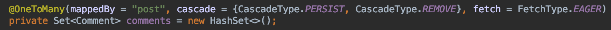
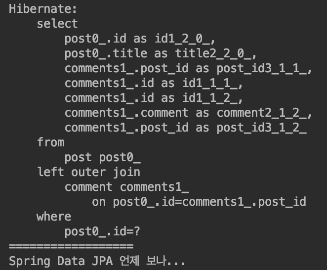
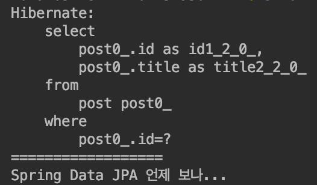

<br/>

# FETCH

연관 관계의 엔티티의 정보를 지금(Eager)혹은 나중에(Lazy) 가져올지 설정하는 기능입니다.

- @OneToMany : 기본값은 **Lazy**입니다.
- 매핑한 정보가 얼마나 많을지 모르기 때문입니다.
- @ManyToOne : 기본값은 **Eager**입니다.
- 매핑한 정보를 함께 가져옵니다.

## Eager

Eager가 적용된 Entity 정보를 미리 다 가져와서 불필요한 조회를 더이상 하지 않습니다.

### Post 클래스

```java
@OneToMany(mappedBy = "post", cascade = {CascadeType.PERSIST, CascadeType.REMOVE}, fetch = FetchType.EAGER)
private Set<Comment> comments = new HashSet<>();
```

 기존값은 **Lazy**지만 Fetch를 주어 **Eager**로 바꾸어줍니다. 이렇게 되면 Post의 정보를 가져올 때 Comment를 지금 함께 가져옵니다.<br/>
 Post와 함께 Comment도 함께 출력되는 것을 볼 수 있습니다.<br/>
<br/>

## Lazy

Lazy가 적용된 Entity 정보를 미리 가져 오지 않습니다.

### Post 클래스

```java
@OneToMany(mappedBy = "post", cascade = {CascadeType.PERSIST, CascadeType.REMOVE})
private Set<Comment> comments = new HashSet<>();
```

Fetch를 제거하면 기본적으로 Lazy상태가 됩니다.<br/>
 결과는 Comment를 지금 가져오지 않습니다.<br/>
<br/>

## session get, load

- load: 가져오려 할때 없으면 **예외**를 던짐 Proxy로도 가져올 수 있습니다.
- get: 무조건 DB에서 가져옵니다. 해당하는게 없으면 예외를 던지지 않고 무조건 레퍼런스를 **null**로 만듭니다.

<br/>
