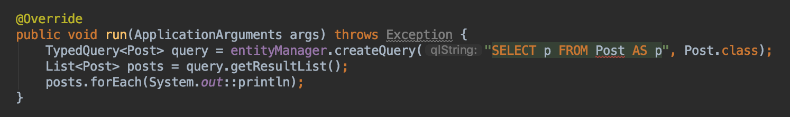
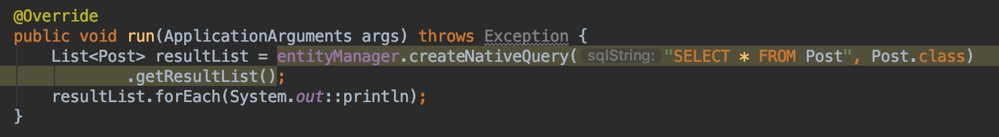

<br/>

# Query

JPA, Hibernate를 사용할 때는 항상 무슨 쿼리를 발생시키는지 그게 의도한 것인지 확인해야합니다. 이런 쿼리를 어떻게 적용시키는지 알아보는 시간을 가지겠습니다.<br/>
<br/>

## JPQL (HQL)

- 데이터베이스 테이블이 아닌, 엔티티 객체 모델 기반으로 쿼리를 작성합니다.
- JPA 또는 하이버네이트가 해당 쿼리를 SQL로 변환해서 실행합니다.
- 참고자료 : [하이버네이트 공식문서](https://docs.jboss.org/hibernate/orm/5.2/userguide/html_single/Hibernate_User_Guide.html#hql)

<br/>
### Post 클래스 title toString 추가
```java
@Override
public String toString() {
    return "Post{" +
            "title='" + title + '\'' +
            '}';
}
```
title만 포함된 **toString**을 만듭니다.<br/>

### JpaRunner 클래스

```java
    @Override
    public void run(ApplicationArguments args) throws Exception {
        TypedQuery<Post> query = entityManager.createQuery("SELECT p FROM Post AS p", Post.class);
        List<Post> posts = query.getResultList();
        posts.forEach(System.out::println);
    }
```

 쿼리에 들어가는 Post는 테이블 이름이 아닌 Entity의 이름입니다.<br/>
<br/>

## Criteria

타입 세이프한 방법이지만 로직이 불편하여 자주 사용하지는 않습니다.

- [하이버네이트 공식문서](https://docs.jboss.org/hibernate/orm/5.2/userguide/html_single/Hibernate_User_Guide.html#criteria)

```java
CriteriaBuilder builder = entityManager.​getCriteriaBuilder​();
CriteriaQuery<Post> criteria = builder.createQuery(Post.class);
Root<Post> root = criteria.from(Post.class);
criteria.select(root);
List<Post> posts = entityManager.​createQuery​(criteria).getResultList();
```

따로 String 문자열의 쿼리를 작성하지 않기 때문에 타입세이프합니다.<br/>
<br/>

## Native Query

Typed 메서드가 아니더라도 지정한 Type으로 결과값을 리턴해줍니다.

- 공식문서 : [하이버네이트 공식문서](https://docs.jboss.org/hibernate/orm/5.2/userguide/html_single/Hibernate_User_Guide.html#sql)

```java
    @Override
    public void run(ApplicationArguments args) throws Exception {
        List<Post> resultList = entityManager.createNativeQuery("SELECT * FROM Post", Post.class)
                .getResultList();
        resultList.forEach(System.out::println);
    }
```

 **createNativeQuery**에 쿼리문, 클래스를 선언하고 List에 Post 클래스를 담습니다. 그리고 List를 가져와 출력합니다.<br/>
