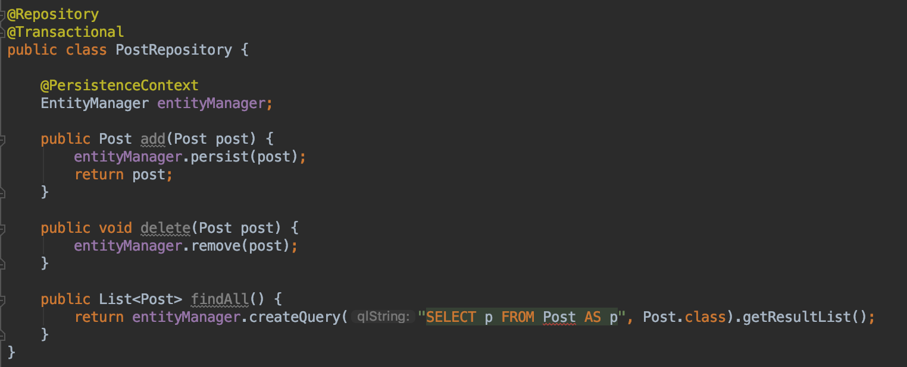
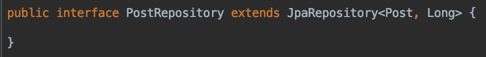
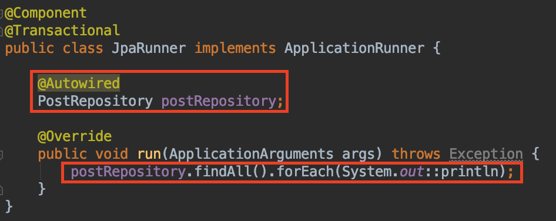
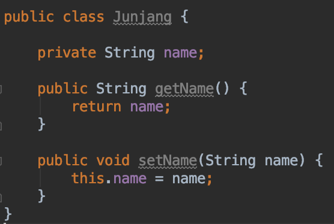
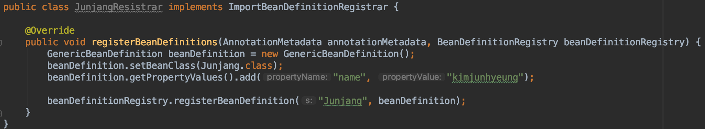
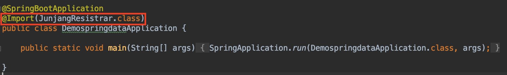
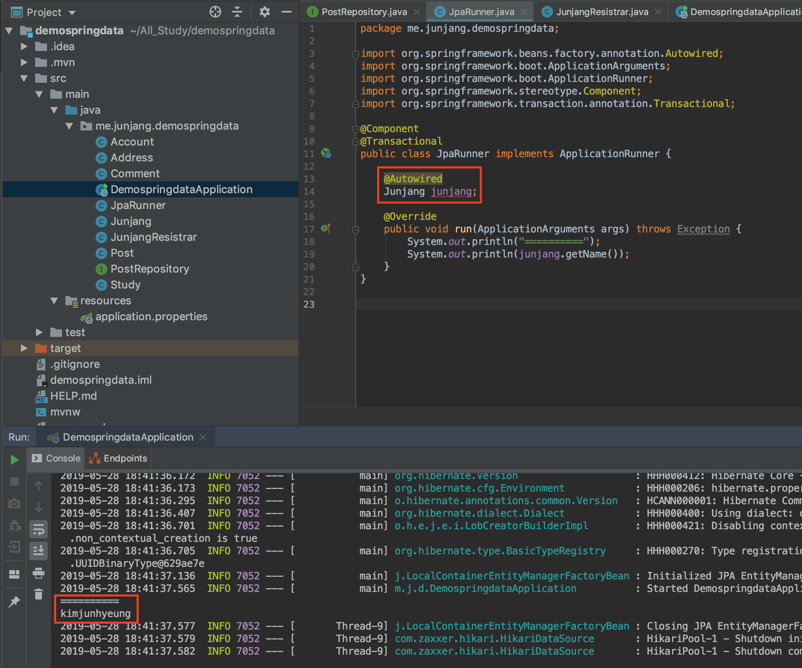

<br/>

# JPA의 원리

JPA가 동작하는 원리에 대해서 학습해보겠습니다.<br/>
<br/>

## JpaRepository<Entity, Id> 인터페이스

- 위 인터페이스를 사용하면 기본적인 CRUD 기능을 포함한 내장 API를 사용할 수 있습니다.
- @Repository가 없어도 빈으로 등록해 줍니다.

<br/>

### JpaRepository가 없을 때 로직

```java
@Repository
@Transactional
public class PostRepository {

    @PersistenceContext
    EntityManager entityManager;

    public Post add(Post post) {
        entityManager.persist(post);
        return post;
    }

    public void delete(Post post) {
        entityManager.remove(post);
    }

    public List<Post> findAll() {
        return entityManager.createQuery("SELECT p FROM Post AS p", Post.class).getResultList();
    }
}
```

 위처럼 하나하나 CRUD에 관련된 로직을 설정해줬었습니다.<br/>
하지만 JPA를 활용하면 아래와 같은 인터페이스 하나로 가능합니다.
 인터페이스로 생성하고 JpaRepository를 상속받아 사용합니다. 이 JpaRepository는 빈으로 등록할 필요도 없습니다.<br/>
 이렇게 만든 인터페이스를 의존성 주입만 받고 바로 사용할 수 있습니다.<br/>
그렇다면 빈으로 등록되는 과정은 어떻게 될까요? 바로 **@EnableJpaRepositories**부터 시작되는 자동설정 입니다.
<br/>

## EnableJpaRepositories

SpringBoot가 아닌 Spring 프로젝트에서는 **@EnableJpaRepositories**를 애플리케이션 클래스에 설정해주어야 합니다.
하지만 SpringBoot에서는 내장이 되어있기 때문에 따로 선언하지 않아도 됩니다.<br/>
그 시작은 **@Import(​JpaRepositoriesRegistrar.class​)**로서 이 클래스에 **​ImportBeanDefinitionRegistrar​**가 빈으로 등록하게 해줍니다. 이 과정을 학습해보겠습니다.<br/>
<br/>

## ImportBeanDefinitionRegistrar​ 구현

### Junjang 클래스

빈으로 등록할 클래스를 생성하겠습니다.

```java
public class Junjang {

    private String name;

    public String getName() {
        return name;
    }

    public void setName(String name) {
        this.name = name;
    }
}
```

 name을 출력하도록 만들어줍니다.<br/>

<br/>
### JunjangRegistrar 클래스 구현
Junjang 클래스를 빈으로 등록하는 과정입니다.
```java
public class JunjangRegistrar implements ImportBeanDefinitionRegistrar {
    @Override
    public void registerBeanDefinitions(AnnotationMetadata importingClassMetadata, BeanDefinitionRegistry registry) {
        GenericBeanDefinition beanDefinition = new GenericBeanDefinition();
        beanDefinition.setBeanClass(Junjang.class);
        beanDefinition.getPropertyValues().add("name", "kimjunhyeung");

        beanDefinitionRegistry.registerBeanDefinition("Junjang", beanDefinition);
    }

}

````
 ImportBeanDefinitionRegistrar를 구현하여 메소드를 오버리아딩 한 후 Junjang 클래스를 가져와 클래스의 변수명과 값을 넣습니다. 그리고 beanDefinitionRegistry에 등록합니다.<br/>
<br/>

### Application 클래스
```java
@SpringBootApplication
@Import(JunjangRegistrar.class)
public class Application {

    public static void main(String[] args) {
        SpringApplication.run(Application.class, args);
    }
}
````

 빈으로 등록할 클래스를 Import 합니다.<br/>
<br/>

### 등록된 빈 사용

```java
@Component
@Transactional
public class JpaRunner implements ApplicationRunner {

    @Autowired
    Junjang junjang;

    @Override
    public void run(ApplicationArguments args) throws Exception {
        System.out.println("=====================");
        System.out.println(Junjang.getName());
    }
}
```

 의존성 주입을 통해 Junjang을 가져와서 출력합니다.<br/>
JPA의 원리를 알아보았습니다. **@Repository**를 하지 않아도 빈으로 등록되는 과정을 학습하고 직접 빈으로 등록도 해보았습니다.
어려운 부분이지만 이해하고 사용을 하면 더 빠르게 학습할 수 있을 것입니다.
