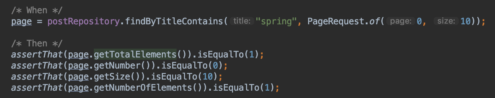

<br/>

# Repository

Repository에는 4가지의 종류가 있습니다.

- Common
- Repository : 일반적인 Marker
- CrudRepository : CRUD 오퍼레이션 제공
- PagingAndSortingRepository : 페이지와 정렬
- JPA
- JpaRepository : Jpa 활용시 사용

이중 Common에 해당되는 Repository를 학습해보겠습니다.
기존 Post 엔티티 클래스와 Repository를 활용할 것이므로 [이전 포스팅](https://junjangsee.github.io/2019/05/23/jpa/jpa-07/), [JPA 원리](https://junjangsee.github.io/2019/05/28/jpa/jpa-10/)를 참고해주시면 되겠습니다.<br/>
<br/>

## Repository 테스트

### 임베디드 DB 추가

```xml
        <dependency>
            <groupId>com.h2database</groupId>
            <artifactId>h2</artifactId>
            <scope>test</scope>
        </dependency>
```

 로컬 데이터에 간섭하지 않고 테스트를 하기 위해 테스트 H2를 추가합니다.<br/>

### Test 클래스

```java
@RunWith(SpringRunner.class)
@DataJpaTest
public class PostRepositoryTest {

    @Autowired
    PostRepository postRepository;

    @Test
    public void crudRepository() {
        /* Given - 이런 조건에서 */
        Post post = new Post();
        post.setTitle("hello spring boot common");
        assertThat(post.getId()).isNull(); /* Trasient 상태이므로 Null입니다 */

        /* When - 이렇게 했을 때 */
        Post newPost = postRepository.save(post); /* post를 저장합니다. */

        /* Then - 이렇게 되길 바란다 */
        assertThat(newPost.getId()).isNotNull(); /* Persist 상태이므로 Null이 아닙니다 */
    }
}
```

Post 클래스에 대한 Repository를 주입 받고 제목을 추가한 다음 Null인지 테스트 하는 로직입니다.<br/>
 위 로직을 실행시키면 테이블은 생성되지만 위 결과처럼 insert가 되지 않고 Id만 찾는 것을 알 수 있습니다.<br/>
그 이유는 H2는 기본적으로 **@Transactional**이 붙어있으면 기본적으로 테스트를 **Rollback**하기 때문에 Hibernate에서는 Rollback한 데이터를 insert할 필요 없다고 판단한 것입니다. 여기서 **Transactional**은 Spring이 자동으로 실행되는 것입니다.
그렇다면 테스트에서 Rollback을 적용하지 않으려면 어떻게 해야할까요?<br/>
<br/>

#### @Rollback(false)

```java
@RunWith(SpringRunner.class)
@DataJpaTest
public class PostRepositoryTest {

    @Autowired
    PostRepository postRepository;

    @Test
    @Rollback(false)
    public void crudRepository() {
        /* Given - 이런 조건에서 */
        Post post = new Post();
        post.setTitle("hello spring boot common");
        assertThat(post.getId()).isNull(); /* Trasient 상태이므로 Null입니다 */

        /* When - 이렇게 했을 때 */
        Post newPost = postRepository.save(post); /* post를 저장합니다. */

        /* Then - 이렇게 되길 바란다 */
        assertThat(newPost.getId()).isNotNull(); /* Persist 상태이므로 Null이 아닙니다 */
    }
}
```

 @Rollback(false)을 통해 Hibernate가 insert할 수 있도록 합니다.<br/>
 짜잔! Hibernate가 Rollback이 안되는걸 알아채고 insert를 했습니다.<br/>
<br/>

### CrudRepository

대표적으로 FindAll()을 활용하여 테스트해보겠습니다.<br/>

```java
        /* When */
        List<Post> posts = postRepository.findAll();

        /* Then */
        assertThat(posts.size()).isEqualTo(1);
        assertThat(posts).contains(newPost);
```

 Repository에 있는 post를 찾아서 List에 담고 1개가 맞는지, newPost에 포함되어 있는지 테스트합니다.<br/>
 테스트가 성공하면 이전에 넣었던 Post를 출력합니다.<br/>
<br/>

### PagingAndSortingRepository

페이지를 이용하여 테스트를 해보겠습니다.<br/>

```java
        /* When */
        Page<Post> page = postRepository.findAll(PageRequest.of(0, 10));

        /* Then */
        assertThat(page.getTotalElements()).isEqualTo(1);
        assertThat(page.getNumber()).isEqualTo(0);
        assertThat(page.getSize()).isEqualTo(10);
        assertThat(page.getNumberOfElements()).isEqualTo(1);
```

 PageRequest.of()를 사용하여 시작페이지, 최대페이지를 설정할 수 있습니다. 이렇게 설정한 페이지는 Page라는 도메인으로 만들어지고 이를 활용할 수 있습니다.

- getTotalElements() : 전체 페이지 개수
- getNumber() : 현제 페이지 넘버
- getSize() : 요청했던 페이지 사이즈
- getNumberOfElements() : 현재 페이지에 들어올 수 있는 개수

<br/>

### Custom 메소드 추가

Custom한 메소드를 추가해서 자신이 원하는 테스트를 진행할 수 있습니다.
참고자료 : [스프링공식문서](https://docs.spring.io/spring-data/jpa/docs/current/reference/html/#repositories)
<br/>

#### FindAll() Custom 메소드

```java
import org.springframework.data.domain.Page;
import org.springframework.data.domain.Pageable;
import org.springframework.data.jpa.repository.JpaRepository;

public interface PostRepository extends JpaRepository<Post, Long> {

    Page<Post> findByTitleContains(String title, Pageable pageable);
}
```

 제목이 포함된 페이지를 찾는 메소드입니다. 제목과 페이지를 가져와야하기 때문에 제목, 페이지를 파라미터로 가져옵니다.<br/>

```java
page = postRepository.findByTitleContains("spring", PageRequest.of(0, 10));

assertThat(page.getTotalElements()).isEqualTo(1);
assertThat(page.getNumber()).isEqualTo(0);
assertThat(page.getSize()).isEqualTo(10);
assertThat(page.getNumberOfElements()).isEqualTo(1);
```

 Spring이 포함된 제목과 0~10 페이지 사이의 데이터를 가져옵니다.<br/>
<br/>

#### 기타 Custom 메소드

FindAll() 뿐만 아니라 다양하게 Custom이 가능합니다.

```java
public interface PostRepository extends JpaRepository<Post, Long> {

    long countByTitleContains(String title);
}
```

Title이 포함되면 카운트 하는 메소드입니다.<br/>

```java
/* When - spring을 가지고 있는 개수를 모두 센다 */
long spring = postRepository.countByTitleContains("spring");
/* Then - 개수는 1이다 */
assertThat(spring).isEqualTo(1);
```

spring이 포함된 제목을 모두 카운팅 해서 spring에 담고 테스트를 진행합니다.<br/>
