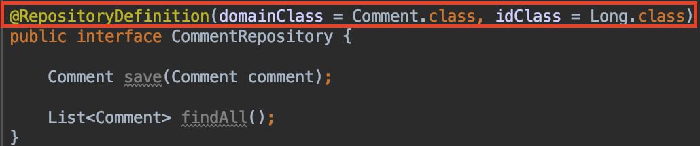
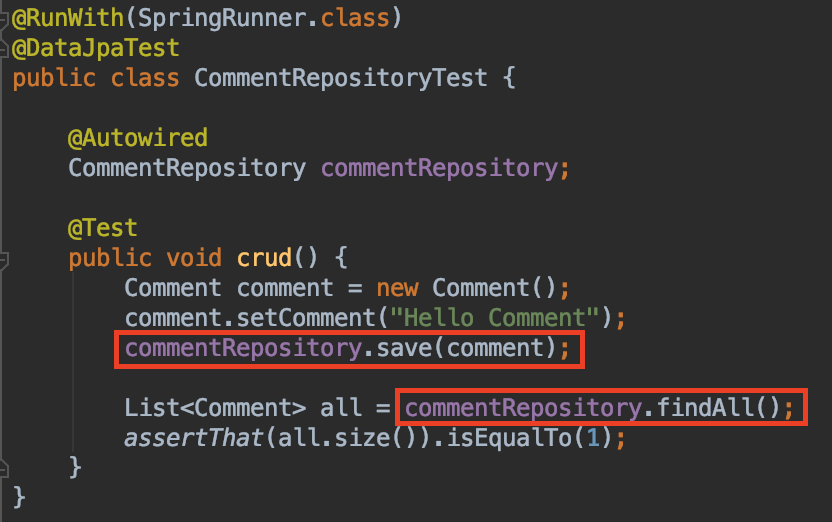
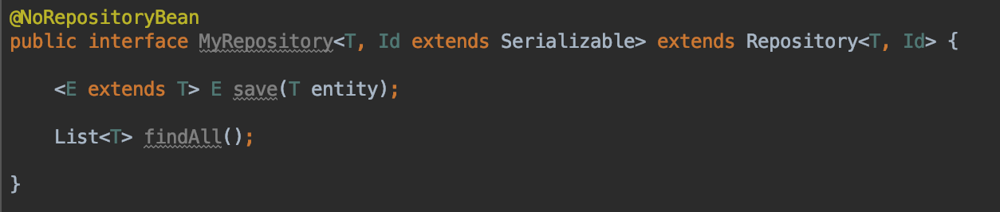

<br/>

# Interface

JpaRepository에서 자동으로 지원되는 기능들을 사용하지 않고 직접 자신이 만든 메소드를 만들고 싶을 때 두 가지 방법을 활용하여 사용합니다.

- 각 엔티티 클래스의 각 Repository를 생성(@RepositoryDefinition)
- 통일된 Repository를 생성한 후 상속(@NoRepositoryBean)

위 두 방법을 학습하기 위해선 기존 Comment 엔티티 클래스와 Repository를 활용할 것이므로 [엔티티 상태](https://junjangsee.github.io/2019/05/28/jpa/jpa-10/)를 참고해주시면 되겠습니다.<br/>
<br/>

## @RepositoryDefinition

내가 원하는 엔티티 클래스에 직접 메소드를 적용시킬 때 사용합니다. 클래스와 Id의 타입을 선언하면 됩니다.<br/>

```java
@RepositoryDefinition(domainClass = Comment.class, idClass = Long.class)
public interface CommentRepository {

    Comment save(Comment comment);

    List<Comment> findAll();
}
```

 **@RepositoryDefinition**에 Comment, Id를 선언하고 JpaRepository와는 다르게 따로 상속받지 않습니다.<br/>

```java
@RunWith(SpringRunner.class)
@DataJpaTest
public class CommentRepositoryTest {

    @Autowired
    CommentRepository commentRepository;

    @Test
    public void crud() {
        Comment comment = new Comment();
        comment.setComment("Hello Comment");
        commentRepository.save(comment);

        List<Comment> all = commentRepository.findAll();
        assertThat(all.size()).isEqualTo(1);
    }
}
```

 테스트를 진행해보면 이상없이 Hello Comment와 데이터 1개의 값을 찾을 수 있습니다.<br/>
<br/>

## @NoRepositoryBean

공통된 메소드를 정의하기 위해서 사용합니다.<br/>

```java
@NoRepositoryBean
public interface MyRepository<T, ID extends Serializable> extends Repository<T, ID> {

    <E extends T> E save(E entity);

    List<T> findAll();
}
```

 MyRepository 인터페이스에 기본적인 **Repository**를 상속받아 클래스, Id를 선언하고 **Serializable**로 직렬화 합니다. **T**에는 자신이 원하는 클래스가 적용되게 됩니다. 그리고 MyRepository를 의존성 주입 받아 사용하면 됩니다.<br/>
보통 JpaRepository에 있는 메소드를 복사해서 필요한 것만 정의하게 됩니다.<br/>
