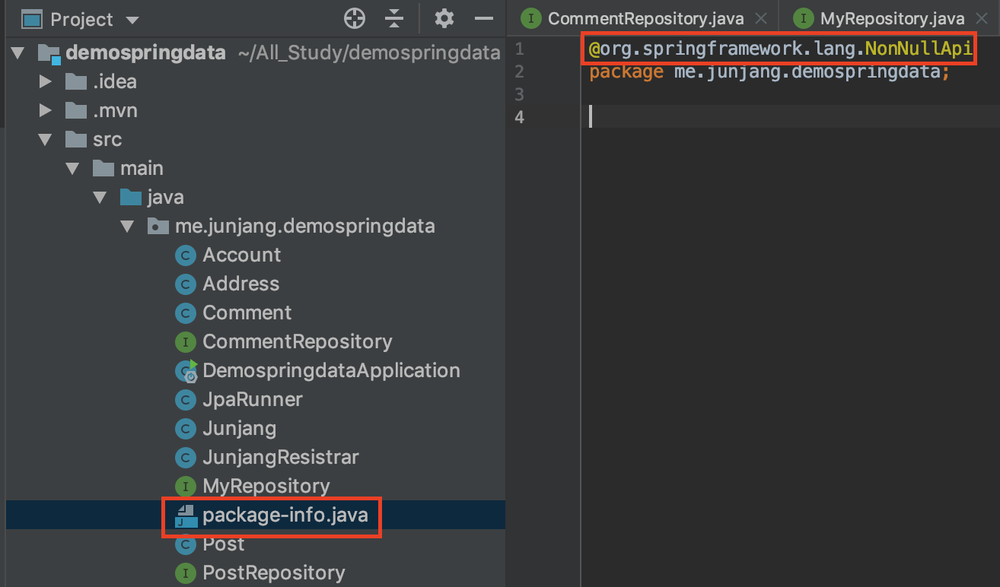
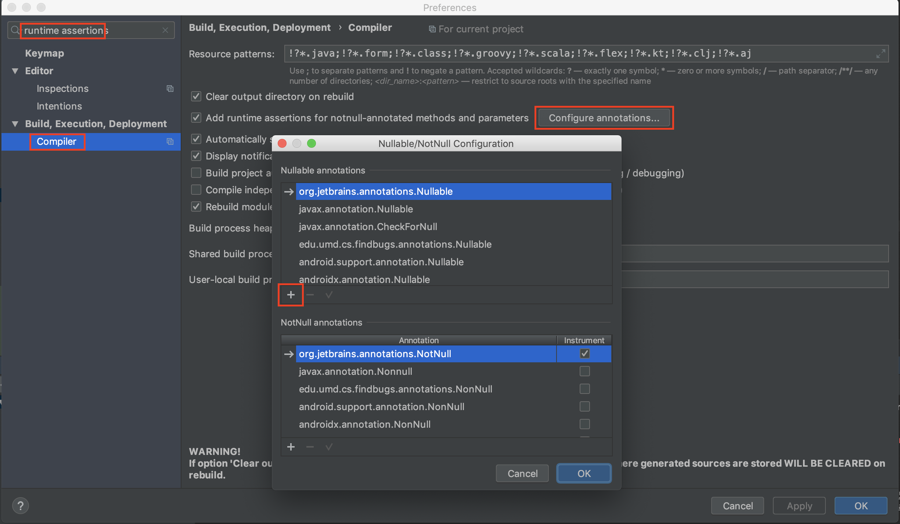
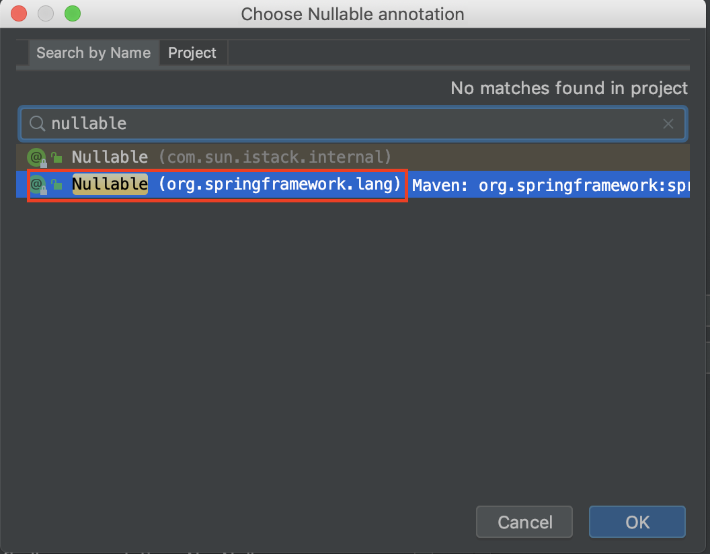
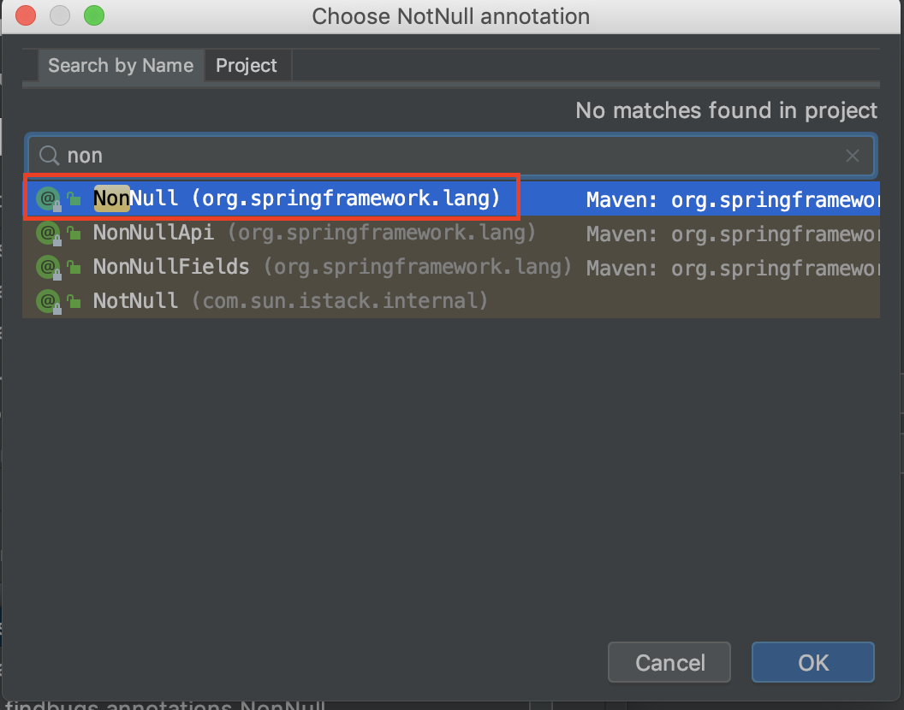
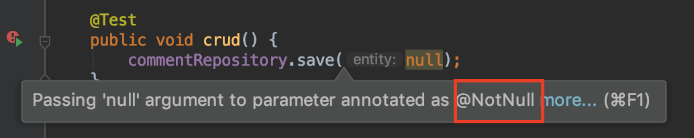

<br/>

# Null 처리

Null을 처리하는 방법에 대해서 학습해봅시다. 여기서 학습할 것은 두 방법입니다.

- 자바 8, 스프링 데이터 2.0 부터 지원하는 **Optioanl**
- 스프링 5.0부터 지원하는 Null관련 **어노테이션**

이전 사용했던 코드들을 계속 사용하기 때문에 [Common Interface](https://junjangsee.github.io/2019/05/31/jpa/jpa-12/)를 참고해주시면 되겠습니다.
<br/>

## Optional

자바 8버전 부터 지원된 기능으로 단일 값을 사용하는 경우 사용합니다. Null을 체크하는 것이 아닌 Optional 인스턴스를 체크하게 됩니다. 최신 트렌디한 방법으로 사용되고 있습니다.<br/>
<br/>

### Optional 기능

- isPresent() : 값이 있는지 없는지 확인합니다.
- orElse : 없는 경우 다른 대체적인 인스턴스를 리턴하게 할 수도 있습니다.
- orElseThrow : 없는 경우 예외를 던집니다.

<br/>

### Optional 사용 방법

Repository에 선언할 메소드에 Optional을 붙여 사용합니다.

```java
@NoRepositoryBean
public interface MyRepository<T, Id extends Serializable> extends Repository<T, Id> {

    <E extends T> Optional<E> findById(Id id);
}
```

Id를 찾는 메소드에 Optional을 사용하여 E 클래스에 적용합니다.<br/>

```java
@RunWith(SpringRunner.class)
@DataJpaTest
public class CommentRepositoryTest {

    @Autowired
    CommentRepository commentRepository;

    @Test
    public void crud() {
        Optional<Comment> byId = commentRepository.findById(100l);
        assertThat(byId).isEmpty();
        //Comment comment = byId.orElse(new Comment()); // Optional 객체가 비어있으면 Comment 만들어서 리턴
        //Comment comment = byId.orElseThrow(() -> new IllegalArgumentException());
        Comment comment = byId.orElseThrow(IllegalArgumentException::new); // lambda를 메서드 레퍼런스로 변환
    }
}
```

기본적으로 **isEmpty()**를 통해 인스턴스가 있는지 확인하는 방법, **orElse()**로 객체가 비어있을 때를 확인하는 방법, **orElseThrow()**로 오류를 출력하는 방법이 있습니다.<br/>
<br/>

#### Optional을 사용하지 않았다면?

만약 Optional을 사용하지 않고 구현했다면 어떻게 구현할까요?

```java
Comment comment = commentRepository.findById(100l);
if (comment == null)
    throw new IllegalArgumentException();
```

위 코드처럼 눈에는 익숙하지만 조건문의 사용과 정돈되지 않은 느낌을 주게 됩니다.<br/>
<br/>

#### 컬렉션의 Null 처리는?

스프링 데이터 JPA가 지원하는 Repository의 컬렉션 타입들은 null이 되지 않고 **비어있는 컬렉션 타입**을 리턴해줍니다.
그러므로 컬렉션을 null 체크하는 코드는 **필요가 없습니다.**

```java
@RunWith(SpringRunner.class)
@DataJpaTest
public class CommentRepositoryTest {

    @Autowired
    CommentRepository commentRepository;

    @Test
    public void crud() {
        List<Comment> comments = commentRepository.findAll();
        assertThat(comments).isEmpty();
    }
}
```

그래서 위와 같이 인스턴스 체크를 하면 됩니다.<br/>
<br/>

## Null 어노테이션

스프링 프레임워크 5.0부터 지원하여 보다 편리하게 Null을 처리할 수 있습니다.

- 런타임 체크를 지원합니다.
- JSR 305 애노테이션을 메타 애노테이션으로 가지고 있습니다.(IDE 및 빌드 툴 지원)<br/>
  <br/>

### Null 어노테이션의 종류

- @NonNullApi: package 레벨에 붙이는 어노테이션
- @NonNull: Null이 아니다.
- @Nullable: Null이 가능하다.

<br/>

### Null 어노테이션 사용 방법

#### @NonNull, @Nullable

```java
@NoRepositoryBean
public interface MyRepository<T, Id extends Serializable> extends Repository<T, Id> {

    <E extends T> E save(@NonNull E entity);

    List<T> findAll();

    long count();

    @Nullable
    <E extends T> Optional<E> findById(Id id);
}
```

파라미터 값이 Null이면 안될 경우 save 메소드처럼 활용하거나, findById 메소드처럼 메소드 자체에 Null이 가능하면 메소드에 선언합니다.<br/>

```java
@RunWith(SpringRunner.class)
@DataJpaTest
public class CommentRepositoryTest {

    @Autowired
    CommentRepository commentRepository;

    @Test
    public void crud() {
      commentRepository.save(null);
    }
}
```

save 메소드를 테스트시 @NonNull이기 때문에 null을 선언하게 되면 Null에러가 출력되게 됩니다.<br/>

#### @NonNullApi

패키지급에 해당되는 기능으로 패키지 하위 전체 메소드, 변수에 NonNull을 적용시킵니다.<br/>
 Package-info에 어노테이션을 사용하여 전체 적용시키면 해당 패키지 하위 모든 적용 대상들은 일괄 적용됩니다.<br/>
<br/>

## IntelliJ 사용시 @Null 어노테이션 사용 방법

IntelliJ에서는 기본적으로 @Null 어노테이션의 제 기능을 사용할 수 있도록 세팅되어 있지 않습니다. 그렇기 때문에 수동으로 어노테이션을 등록하여 사용하여야 합니다. 그 방법에 대해 알아보겠습니다.<br/>
 설정에 들어가서 **runtime assertions**를 입력 후 **Compiler**를 클릭하고 Configure annotations를 클릭합니다.
그러면 `+`버튼이 보이는데 위에 있는 것부터 먼저 클릭합니다.<br/>
 springframework의 @Nullable를 선택 후 OK를 누릅니다.<br/>
 아래의 `+`를 누른 후 springframework의 @NonNull을 선택하고 OK를 누릅니다.<br/>
 다시 프로젝트를 재부팅 하면 @NonNull이 적용된 파라미터에 null을 넣으려고 하면 색이 적용되면서 안내창이 뜨면서 보다 편리하게 사용할 수 있습니다.<br/>
