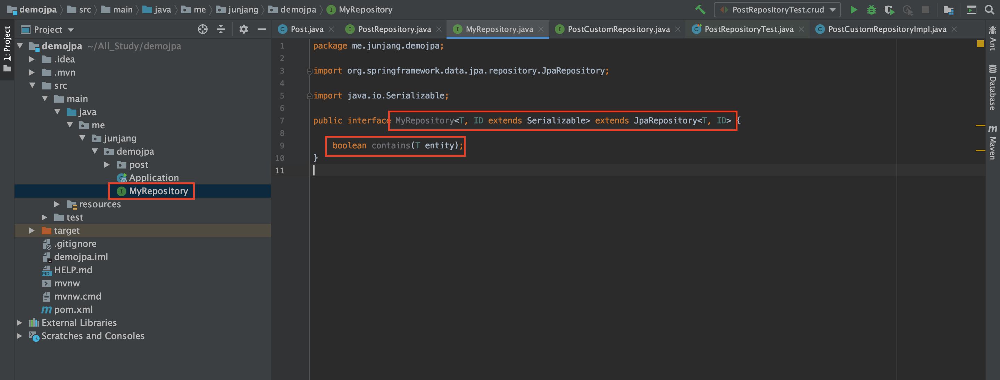
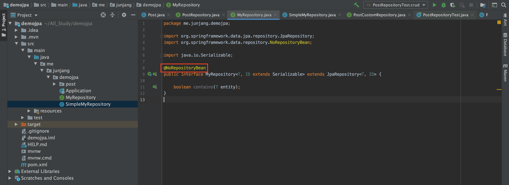
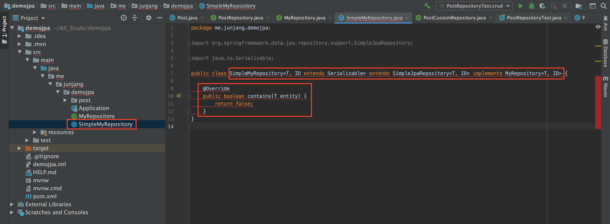
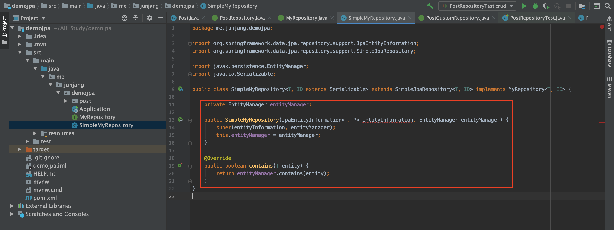
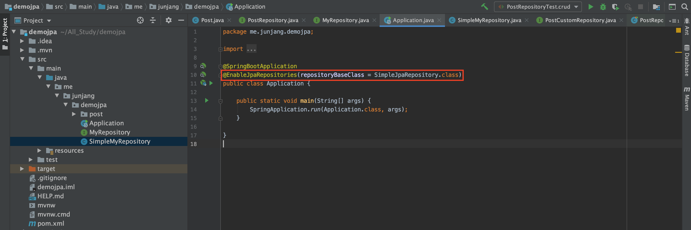
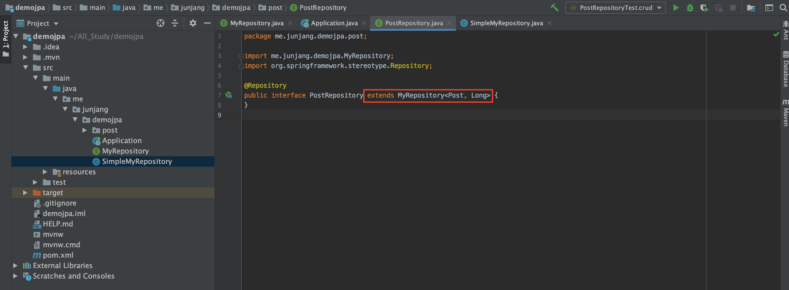
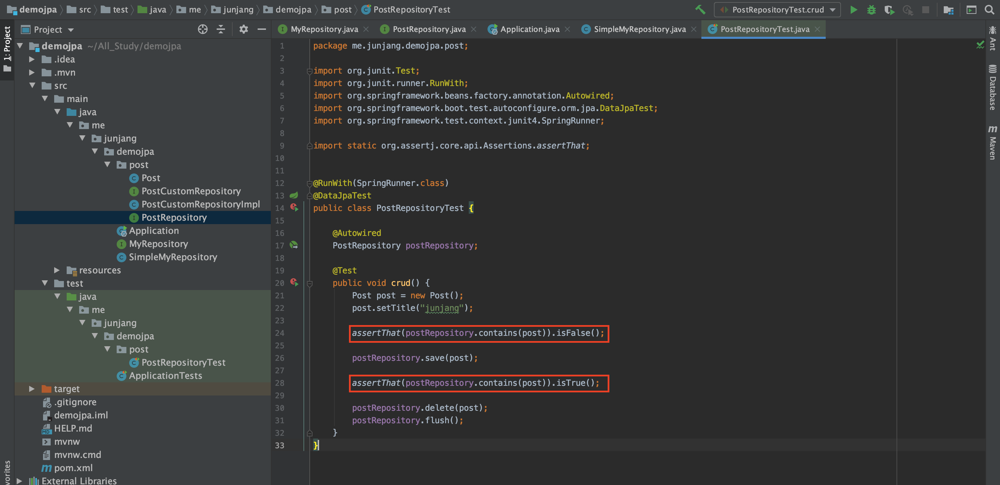

<br/>

# BasicRepository

모든 리포지토리에 공통적으로 추가하고 싶은 기능이 있거나 덮어쓰고 싶은 기능이 있을 때 사용합니다. 구현하는 방법은 아래와 같습니다.

1. JpaRepository를 상속 받는 인터페이스 정의하기
   - @NoRepositoryBean
2. 기본 구현체를 상속 받는 커스텀 구현체 만들기
3. @EnableJpaRepositories에 설정하기
   - repositoryBaseClass

## 1. JpaRepository를 상속 받는 인터페이스 정의하기

```java
@NoRepositoryBean
public interface MyRepository<T, ID extends Serializable> extends JpaRepository<T, ID> {

    boolean contains(T entity);
}
```

 우선 공통으로 사용할 리파지토리를 생성하고 JpaRepository를 상속받습니다. 예제로는 영속성 상태를 포함하는지 여부를 확인하는 메소드를 정의하였습니다.<br/>
 그리고 `@NoRepositoryBean`을 선언하여 설정하는 리파지토리에 대한 빈 등록을 방지합니다.<br/>
<br/>

## 2. 기본 구현체를 상속 받는 커스텀 구현체 만들기

 네이밍과 상관없이 클래스를 생성하고 SimpleJpaRepository를 상속받고 공통으로 사용할 리파지토리를 구현합니다.
여기서 아직 에러가 발생할텐데 이는 생성자를 생성해주어야 사라집니다.<br/>

```java
public class SimpleMyRepository<T, ID extends Serializable> extends SimpleJpaRepository<T, ID> implements MyRepository<T, ID> {

    private EntityManager entityManager;

    public SimpleMyRepository(JpaEntityInformation<T, ?> entityInformation, EntityManager entityManager) {
        super(entityInformation, entityManager);
        this.entityManager = entityManager;
    }

    @Override
    public boolean contains(T entity) {
        return entityManager.contains(entity);
    }
}
```

 SimpleMyRepository 생성자를 만들고 EntityManager를 추가합니다. 그리고 contains에 대한 메소드도 재정의합니다.<br/>
<br/>

## 3. @EnableJpaRepositories에 설정하기

```java
@EnableJpaRepositories(repositoryBaseClass = SimpleJpaRepository.class)
```

 Application.class에 SimpleJpaRepository를 추가해서 기본으로 가져갈 수 있도록 합니다.<br/>
 그리고 최종적으로 PostRepository에 MyRepository를 상속받아 사용할 수 있도록 합니다.<br/>

```java
    @Test
    public void crud() {
        Post post = new Post();
        post.setTitle("junjang");

        assertThat(postRepository.contains(post)).isFalse();

        postRepository.save(post);

        assertThat(postRepository.contains(post)).isTrue();

        postRepository.delete(post);
        postRepository.flush();
    }
```

 테스트를 진행하면 이상 없는 것을 확인할 수 있습니다!
