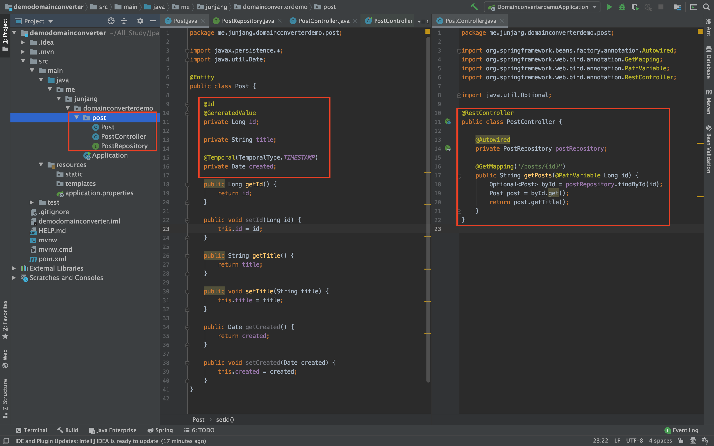
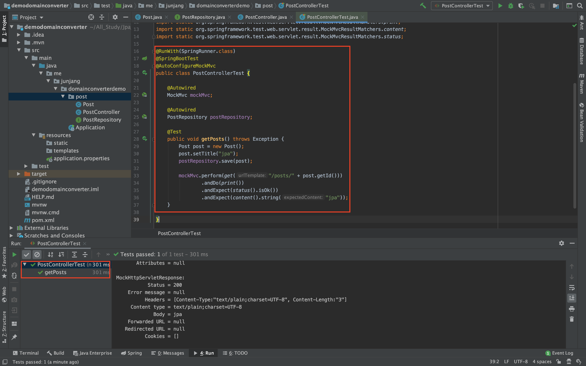
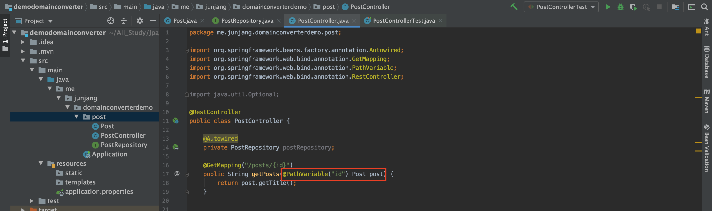

<br/>

# DomainClassConverter

하나의 타입을 다른 타입으로 변환하는 인터페이스로서 엔티티 혹은 ID를 각각의 타입으로 자동으로 변환해줍니다. 컨버팅에는 2가지 종류가 있습니다.

- ToEntityConverter: 어떠한 Entity의 Id를 받아서 그 Entity 타입으로 변환하는 Converter입니다.
- ToIdConverter: Entity를 그 Entity의 Id 타입으로 변환하는 Converter입니다.

침고자료 : [레퍼런스](https://docs.spring.io/spring-framework/docs/current/javadoc-api/org/springframework/core/convert/converter/Converter.html)

<br/>

## Entity, Repository, Controller 생성

```java
@RestController
public class PostController {

    @Autowired
    private PostRepository postRepository;

    @GetMapping("/posts/{id}")
    public String getPosts(@PathVariable Long id) {
        Optional<Post> byId = postRepository.findById(id);
        Post post = byId.get();
        return post.getTitle();
    }

}
```

 Post, PostRepository, Controller를 생성합니다.
Controller는 `@Pathvariable`을 통해 Long 타입의 id를 받아 id를 Post에 담고 제목을 return 하는 코드입니다.<br/>
<br/>

## 테스트 코드

### Long 타입

```java
package me.junjang.domainconverterdemo.post;

import org.junit.Test;
import org.junit.runner.RunWith;
import org.springframework.beans.factory.annotation.Autowired;
import org.springframework.boot.test.autoconfigure.web.servlet.AutoConfigureMockMvc;
import org.springframework.boot.test.context.SpringBootTest;
import org.springframework.test.context.junit4.SpringRunner;
import org.springframework.test.web.servlet.MockMvc;

import static org.springframework.test.web.servlet.request.MockMvcRequestBuilders.get;
import static org.springframework.test.web.servlet.result.MockMvcResultHandlers.print;
import static org.springframework.test.web.servlet.result.MockMvcResultMatchers.content;
import static org.springframework.test.web.servlet.result.MockMvcResultMatchers.status;

@RunWith(SpringRunner.class)
@SpringBootTest
@AutoConfigureMockMvc
public class PostControllerTest {

    @Autowired
    MockMvc mockMvc;

    @Autowired
    PostRepository postRepository;

    @Test
    public void getPosts() throws Exception {
        Post post = new Post();
        post.setTitle("jpa");
        postRepository.save(post);

        mockMvc.perform(get("/posts/" + post.getId()))
                .andDo(print())
                .andExpect(status().isOk())
                .andExpect(content().string("jpa"));
    }

}
```

 Post 객체를 생성하고 jpa라는 제목을 set 해준 후 save합니다. 그 후 `@PathVariable`로 선언한 id를 보내주고 상태코드와 jpa라는 제목을 가졌는지 확인하고, 이상이 없다면 테스트가 통과하게 됩니다.<br/>
<br/>

### Entity 타입

id로 받아올 경우 컨버팅을 할 때 id를 찾고 담는 부분을 **제외하고** 찾아올 수가 있습니다.
더이상 post 매개변수 이름이 @PathVariable 이름과 **같지 않기 때문에** 바인딩 받을 때 사용할 @PathVariable 이름을 반드시 **@PathVariable("id")** 라고 명시해주어야 합니다.
이 때 id에 해당하는것을 post로 받게 되면 그 때 `DomainClassConverter`가 동작합니다.

```java
@GetMapping("/posts/{id}")
public String getPost(@PathVariable("id") Post post) {
    return post.getTitle();
}
```

 위 코드처럼 Post로 받게 된다면 **id**를 꼭 명시 해주어야 합니다. 테스트를 실행하면 동일한 결과가 나올 것입니다.<br/>
