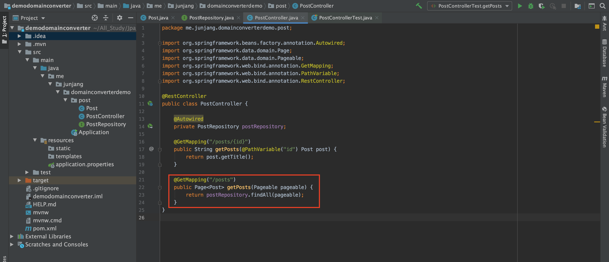
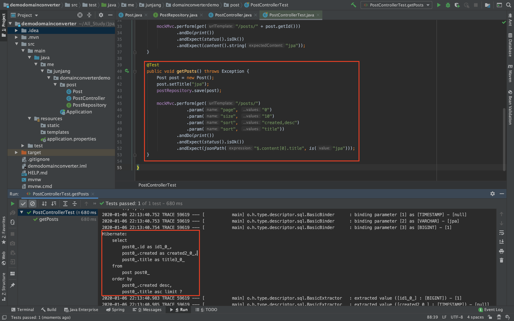

<br/>

# 스프링 MVC HandlerMethodArgumentResolver

스프링 MVC 핸들러 메소드의 매개변수로 받을 수 있는 객체를 확장하고 싶을 때 사용하는 인터페이스로 이번에 실습해볼 Pageable과 Sort를 매개변수로 사용할 수 있습니다.<br/>
참고자료 : [레퍼런스](https://docs.spring.io/spring/docs/current/javadoc-api/org/springframework/web/method/support/HandlerMethodArgumentResolver.html)

<br/>

## 페이징과 정렬 관련 매개변수

- page: 0부터 시작.
- size: 기본값 20.
- sort: property,property(,ASC|DESC)
- 예) sort=created,desc&sort=title (asc가 기본값)

## Pageable, Sort

```java
@RestController
public class PostController {

    @Autowired
    private PostRepository postRepository;

    @GetMapping("/posts")
    public Page<Post> getPosts(Pageable pageable) {
        return postRepository.findAll(pageable);
    }
}
```

 Page객체를 리턴하고 파라미터로 Pageable을 받습니다. 파라미터로 받는 Pageable은 따로 설정하지 않으면 기본값을 가지고 있습니다.<br/>

```java
    @Test
    public void getPosts() throws Exception {
        Post post = new Post();
        post.setTitle("jpa");
        postRepository.save(post);

        mockMvc.perform(get("/posts/")
                    .param("page", "0")
                    .param("size", "10")
                    .param("sort", "created,desc")
                    .param("sort", "title"))
                .andDo(print())
                .andExpect(status().isOk())
                .andExpect(jsonPath("$.content[0].title", is("jpa")));
    }
```

 생성한 RestContoller에 param을 추가하여 page는 0, size는 10, 정렬을 생성일자로하고 만약 동시에 생성된다면 제목으로 정렬되게끔 테스트해보면, 이상없이 테스트가 완료되는 것을 볼 수 있습니다.
