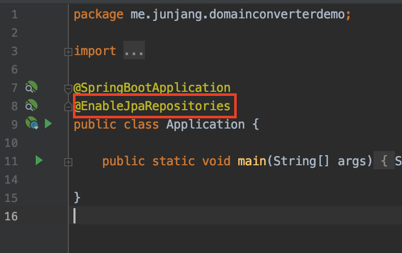
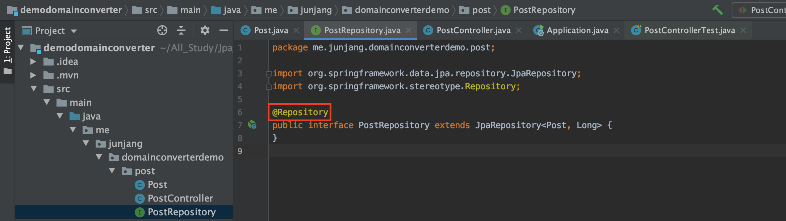
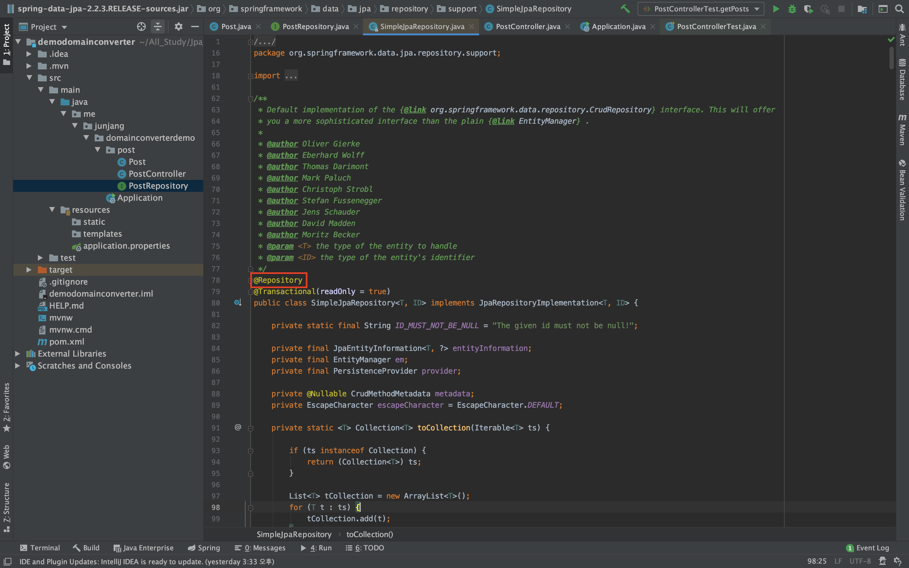
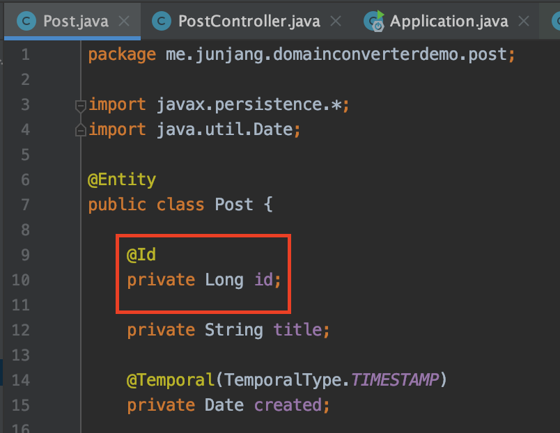
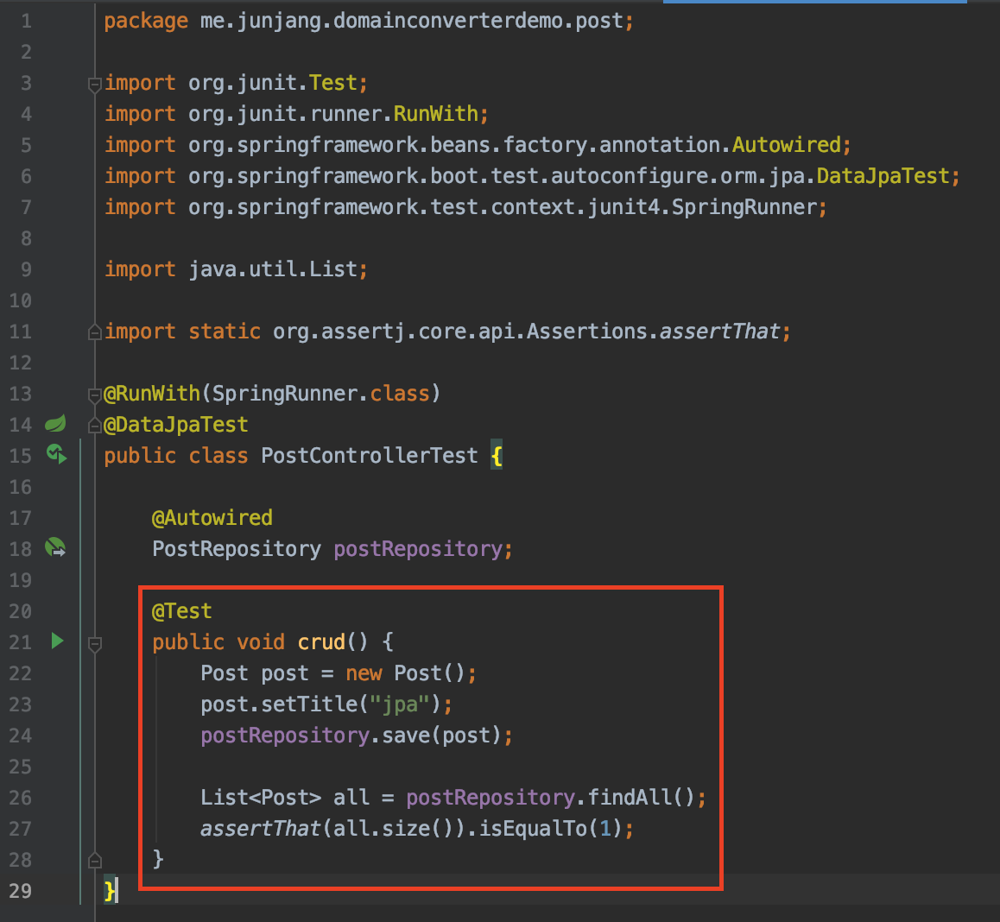
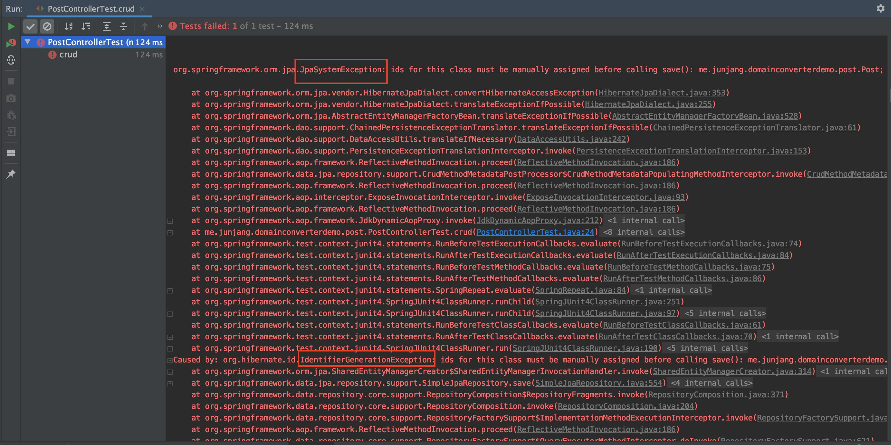

<br/>

# 스프링 데이터 JPA Repository

## @EnableJpaRepositories

 JPA Repository를 사용하기 위해서는 Spring Framework 에서는 `@EnableJpaRepositories` 애노테이션을 사용해야 JpaRepository 인터페이스를 상속받은 Repository 인터페이스 타입의 Proxy 빈들을 등록해줍니다. 하지만 스프링 부트 사용할 때는 사용하지 않아도 자동 설정이 되므로 따로 세팅하지 않아도 됩니다.<br/>

> 스프링 부트를 사용하지 않을 때는 @Configuration과 같이 사용합니다.

<br/>

## @Repository

 `@Repository`애노테이션은 JpaRepository의 기본 구현체인 SimpleJpaRepository가 가지고 있기 떄문에 또 사용하지 않아도 됩니다.<br/>
 SimpleJpaRepository 클래스에 `@Repository`애노테이션이 선언되어있는 것을 볼 수 있습니다.<br/>
<br/>

### @Repository를 사용한다면 ?

SQLExcpetion 또는 JPA 관련 예외를 스프링의 DataAccessException 계층구조 하위클래스중 하나로 변환 해주는 역할을 합니다. 쉽게 말씀드리면 예외만 보더라도 어떤일이 발생했는지 이해하기 쉽도록 변환해 주는 역할을 하며 기본적인 스프링 프레임워크의 기능에 속합니다. `DataAccessException` 계층구조를 만들고 구체적인 하위 클래스들 중 하나로 Mapping을 해서 클래스 이름만 봐도 에러를 찾을 수 있게 됩니다.<br/>

```java
package me.junjang.domainconverterdemo.post;

import javax.persistence.*;
import java.util.Date;

@Entity
public class Post {

    @Id
    // @GenerateValue
    private Long id;

    private String title;

    @Temporal(TemporalType.TIMESTAMP)
    private Date created;
}

```

 자동으로 Id를 생성해주는 `@GenerateValue`를 선언하지 않고 save를 할 때 에러코드를 보겠습니다.<br/>

```java
import static org.assertj.core.api.Assertions.assertThat;

@RunWith(SpringRunner.class)
@DataJpaTest
public class PostControllerTest {

    @Autowired
    PostRepository postRepository;

    @Test
    public void crud() {
        Post post = new Post();
        post.setTitle("jpa");
        postRepository.save(post);

        List<Post> all = postRepository.findAll();
        assertThat(all.size()).isEqualTo(1);
    }
}
```

 원래는 post.setId를 통해 Id를 수동으로 넣어주어야 하지만 이 상태로 Test를 실행할 경우 에러가 출력됩니다.<br/>

> org.springframework.orm.jpa.JpaSystemException: ids for this class must be manually assigned before calling save(): me.junjang.domainconverterdemo.post.Post;

> Caused by: org.hibernate.id.IdentifierGenerationException: ids for this class must be manually assigned before calling save(): me.junjang.domainconverterdemo.post.Post

 위의 에러가 @Repository를 사용했을 떄의 에러, 밑의 에러가 사용하지 않았을 때의 에러입니다. Jpa의 에러라는 것을 에러로그만으로도 확실하게 알 수 있습니다.
