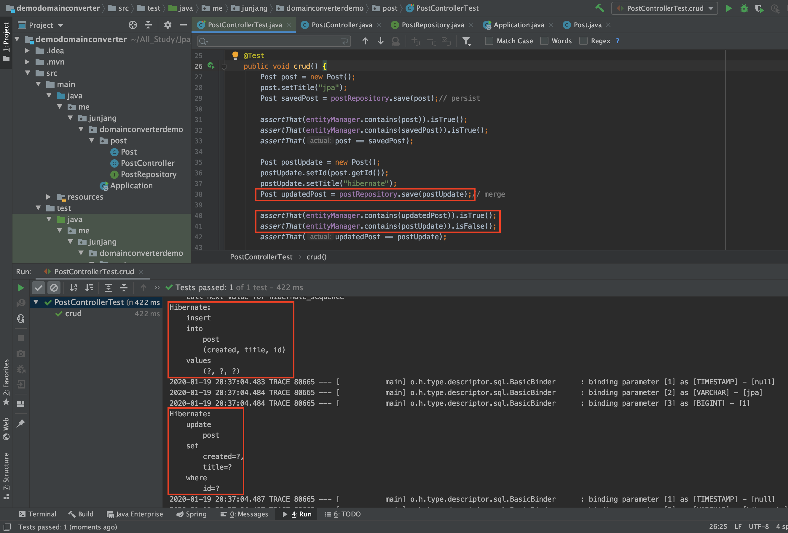

<br/>

# JpaRepository.save()

## 엔티티 저장하기

> 내부적으로 save()는 객체가 새로운 객체인지 다른 객체인지 판단을 합니다.

- Transient(새로운) 상태의 객체라면 EntityManager.persist()
- Detached(이미있는) 상태의 객체라면 EntityManager.merge()

위 두 가지의 상태를 구분하여 **insert** 혹은 **update**를 판단하게 됩니다.<br/>
<br/>

## Transient와 Detached의 상태 판단은?

- 엔티티의 @Id 프로퍼티를 찾아서 해당 프로퍼티가 null이면 **Transient** 상태로 판단하고 id가 null이 아니면 **Detached** 상태로 판단합니다.
- 엔티티가 Persistable 인터페이스를 구현하고 있다면 isNew() 메소드에 위임합니다.
- JpaRepositoryFactory를 상속받는 클래스를 만들고 getEntityInfomration()을 오버라이딩해서 자신이 원하는 판단 로직을 구현할 수도 있습니다.

<br/>

### EntityManager.persist()

[persist](https://docs.oracle.com/javaee/6/api/javax/persistence/EntityManager.html#persist(java.lang.Object)

> persist() 메소드에 넘긴 그 엔티티 객체를 Persistent 상태로 변경합니다

- Transient 상태의 객체 : 새로 만들어진 객체라서 ID가 없고 ID에 맵핑되는 데이터베이스 레코드가 전혀 없는 상태라 Hibernate, Database 둘 다 아무도 모르는 상태입니다.
- Persistent : Transient 상태의 객체를 persist 했을 때 persistenceContext가 관리를 하는 상태입니다.

<br/>

### EntityManager.merge()

[merge](https://docs.oracle.com/javaee/6/api/javax/persistence/EntityManager.html#merge(java.lang.Object)

> merge() 메소드에 넘긴 그 엔티티의 복사본을 만들고, 그 복사본을 다시 Persistent 상태로 변경하고 그 복사본을 반환하는 방식이며, 데이터베이스에 sync를 하므로 Entity의 상태변화를 데이터베이스에 Update 시킵니다. 만약 ID가 데이터베이스에 해당하는게 없으면 새로운 데이터를 Insert 합니다.

- Detached 상태의 객체 : 한 번이라도 데이터베이스에 Persistent 상태가 됐던 객체입니다. 이 객체에 맵핑이 되는 레코드가 테이블에 있는 경우 즉, 이 객체는 ID가 있음 ID에 맵핑이 되는 테이블 데이터가 있을 수도 있고, 없으면 새로 추가됩니다.

<br/>

## 예제

```java
    @Test
    public void crud() {
        Post post = new Post();
        post.setId(1L);
        post.setTitle("jpa");
        postRepository.save(post);/* persist */

        Post postUpdate = new Post();
        postUpdate.setId(1L);
        postUpdate.setTitle("hibernate");
        postRepository.save(postUpdate);/* merge */

        List<Post> all = postRepository.findAll();
        assertThat(all.size()).isEqualTo(1);
    }
```

 post 객체는 `transient` 상태이므로 insert가 발생하게 되고, postUpdate 객체는 `detached` 상태이므로 update가 발생하게 됩니다.<br/>

```java
@Test
    public void crud() {
        Post post = new Post();
        post.setTitle("jpa");
        Post savedPost = postRepository.save(post);/* persist */

        assertThat(entityManager.contains(post)).isTrue();
        assertThat(entityManager.contains(savedPost)).isTrue();
        assertThat(post == savedPost);

        Post postUpdate = new Post();
        postUpdate.setId(post.getId());
        postUpdate.setTitle("hibernate");
        Post updatedPost = postRepository.save(postUpdate);/* merge */

        assertThat(entityManager.contains(updatedPost)).isTrue();
        assertThat(entityManager.contains(postUpdate)).isFalse();
        assertThat(updatedPost == postUpdate);

        List<Post> all = postRepository.findAll();
        assertThat(all.size()).isEqualTo(1);
    }
```

 post를 캐싱하고 있으며와 savedPost의 인스턴스를 가지고 있어서 같으며, updatedPost는 캐싱하고 있고 postUpdate는 캐싱하고 있지 않으므로 두 인스턴스는 다릅니다.<br/>

```java
    @Test
    public void crud() {
        Post post = new Post();
        post.setTitle("jpa");
        Post savedPost = postRepository.save(post);/* persist */

        Post postUpdate = new Post();
        postUpdate.setId(post.getId());
        postUpdate.setTitle("hibernate");
        Post updatedPost = postRepository.save(postUpdate);/* merge */

        postUpdate.setTitle("merge");
        updatedPost.setTitle("persist");

        List<Post> all = postRepository.findAll();
        assertThat(all.size()).isEqualTo(1);
    }
```

 `merge` 상태인 postUpdate는 반영이 되지 않으며 `persist` 상태인 updatedPost는 반영이 됩니다.<br/>
